# Revisión clínica independiente — imágenes y casos documentales

## Instrucciones para David

Esta revisión es distinta de la auditoría anterior del resultado 80/100.
Aquí no se evalúa a DxGPT ni al juez automático. Se comprueba que las
etiquetas y casos usados como referencia sean correctos.

No necesitas programar ni ejecutar nada. Abre este archivo en vista previa
Markdown para poder ver las imágenes. En Cursor puedes usar `Ctrl+Shift+V`.

Completa los espacios marcados con `RESPUESTA`. Si una cuestión requiere
criterio médico y no puedes cerrarla con seguridad, escribe
`CONSULTAR MÉDICO`. No adivines.

Tiempo estimado: 2–3 horas.

---

## Parte A — clasificación de 12 imágenes

Para cada imagen elige una categoría:

- **DOCUMENTAL**: solo contiene texto, formularios, tablas o resultados.
- **MÉDICA**: contiene una radiografía, CT, MRI, ecografía, fotografía
  clínica, fondo de ojo, gráfico médico u otra evidencia visual clínica.
- **MIXTA**: contiene una imagen médica y además un bloque de texto clínico
  autónomo y sustancial que merece ser extraído.
- **NO PUEDO DECIDIR**: la imagen o el criterio no son suficientemente claros.

Flechas, letras de panel, escalas, nombres anatómicos y medidas breves no
convierten por sí solos una imagen médica en mixta.

### A1 — 24174966

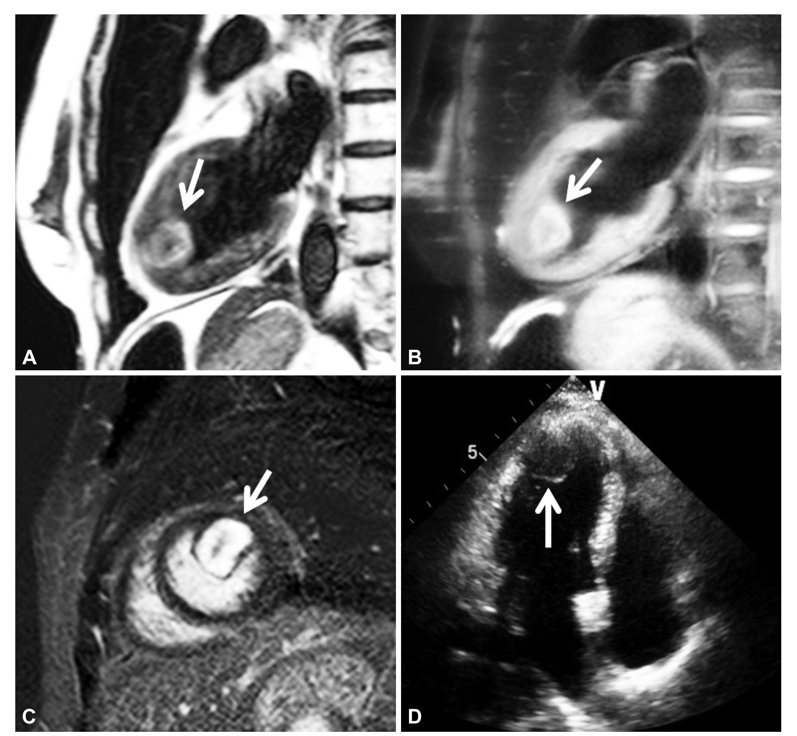

- Categoría: **RESPUESTA**
- Confianza — alta / media / baja: **RESPUESTA**
- Motivo en una frase: **RESPUESTA**

### A2 — 25995698

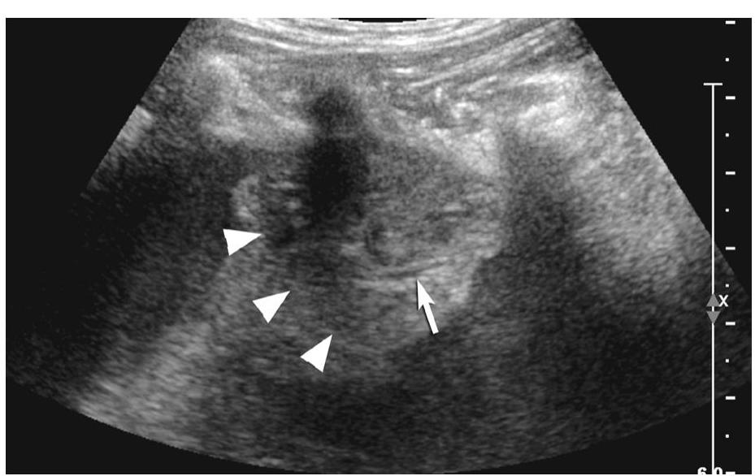

- Categoría: **RESPUESTA**
- Confianza — alta / media / baja: **RESPUESTA**
- Motivo en una frase: **RESPUESTA**

### A3 — 23553973

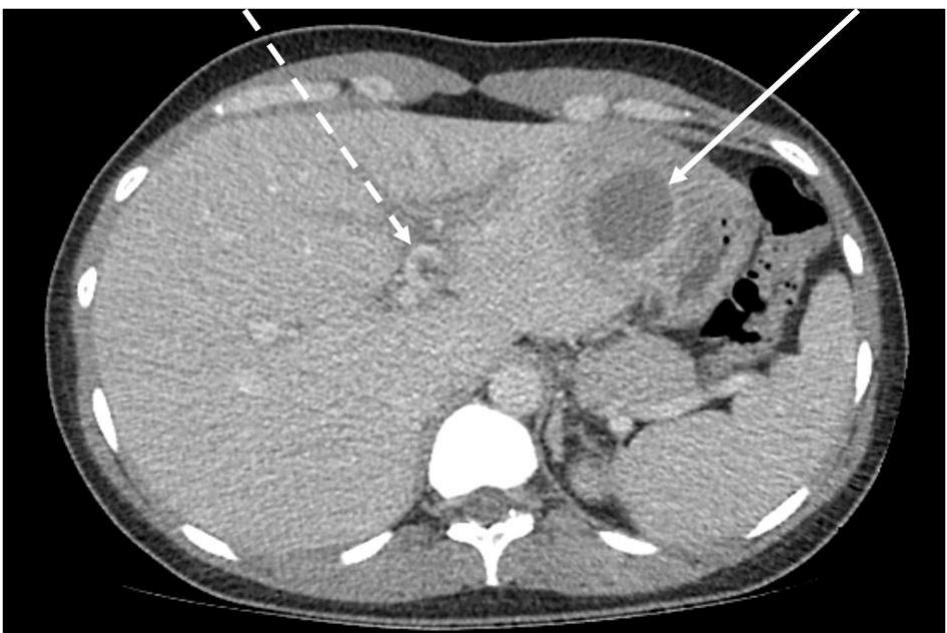

- Categoría: **RESPUESTA**
- Confianza — alta / media / baja: **RESPUESTA**
- Motivo en una frase: **RESPUESTA**

### A4 — 27656661

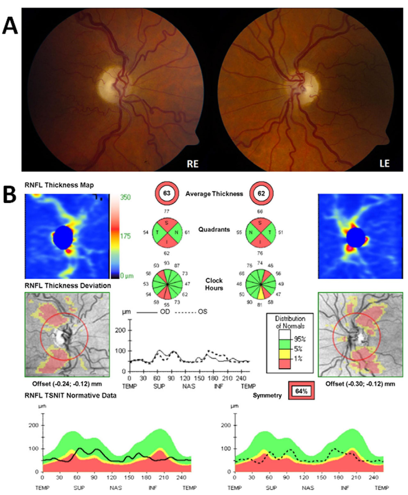

- Categoría: **RESPUESTA**
- Confianza — alta / media / baja: **RESPUESTA**
- Motivo en una frase: **RESPUESTA**

### A5 — N-10000022

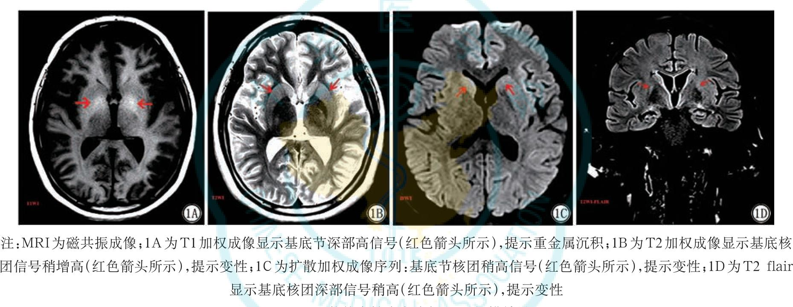

- Categoría: **RESPUESTA**
- ¿El texto chino inferior parece un bloque clínico sustancial o solamente
  una leyenda breve?: **RESPUESTA**
- Confianza — alta / media / baja: **RESPUESTA**
- Motivo en una frase: **RESPUESTA**

### A6 — 27380346

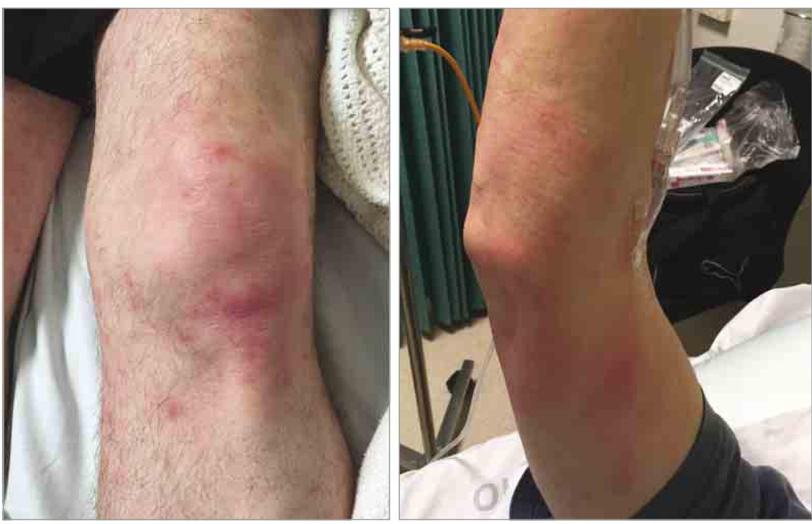

- Categoría: **RESPUESTA**
- Confianza — alta / media / baja: **RESPUESTA**
- Motivo en una frase: **RESPUESTA**

### A7 — 28126713

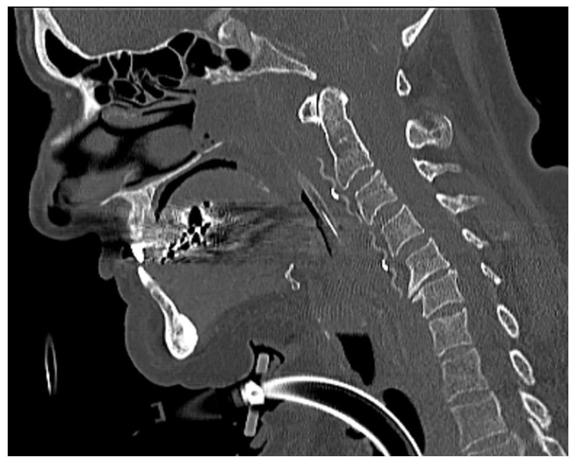

- Categoría: **RESPUESTA**
- Confianza — alta / media / baja: **RESPUESTA**
- Motivo en una frase: **RESPUESTA**

### A8 — 23449674

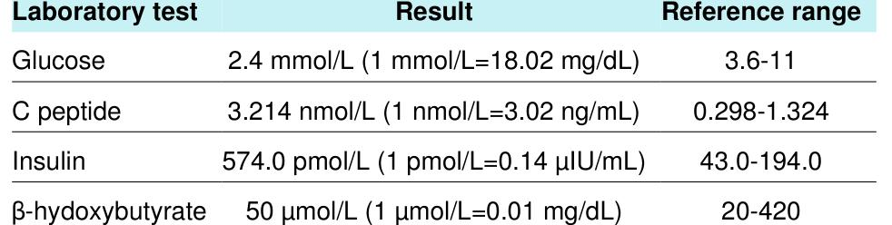

- Categoría: **RESPUESTA**
- Confianza — alta / media / baja: **RESPUESTA**
- Motivo en una frase: **RESPUESTA**

### A9 — case-19003

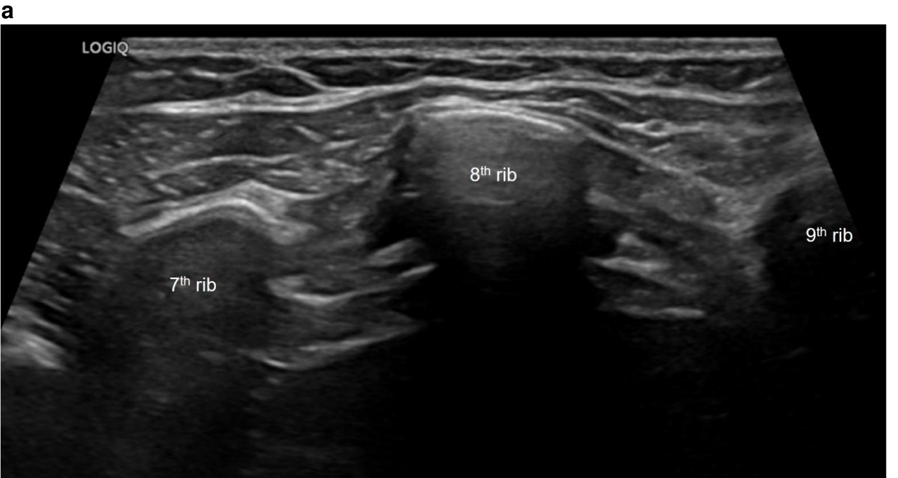

- Categoría: **RESPUESTA**
- Confianza — alta / media / baja: **RESPUESTA**
- Motivo en una frase: **RESPUESTA**

### A10 — 20052363

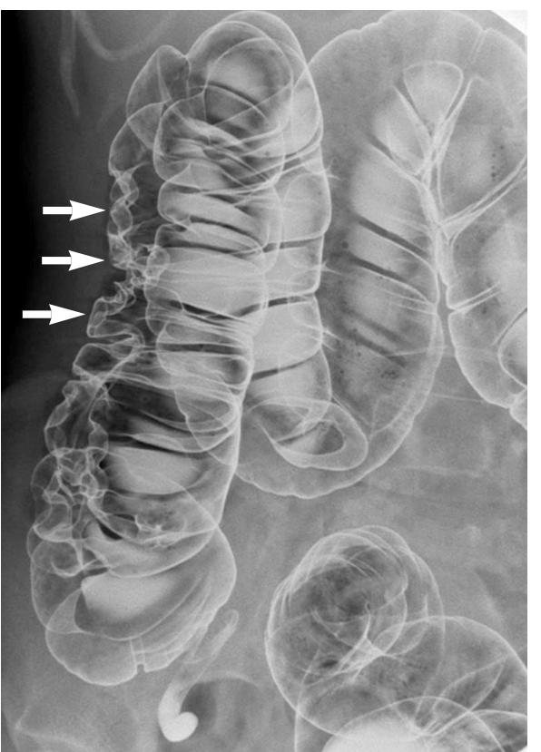

- Categoría: **RESPUESTA**
- Confianza — alta / media / baja: **RESPUESTA**
- Motivo en una frase: **RESPUESTA**

### A11 — 30687305

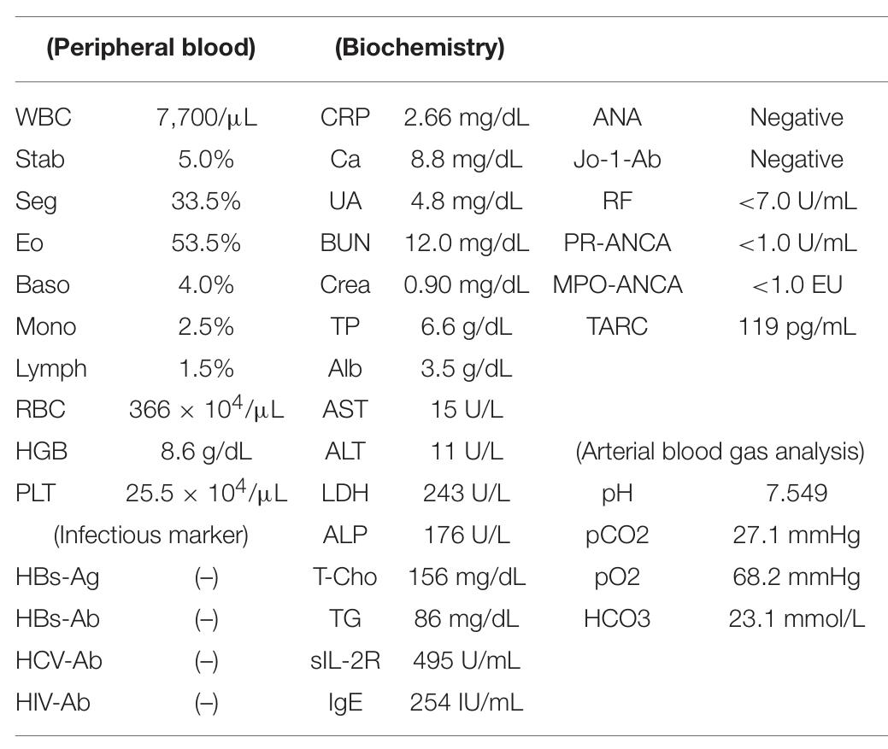

- Categoría: **RESPUESTA**
- Confianza — alta / media / baja: **RESPUESTA**
- Motivo en una frase: **RESPUESTA**

### A12 — 27074070

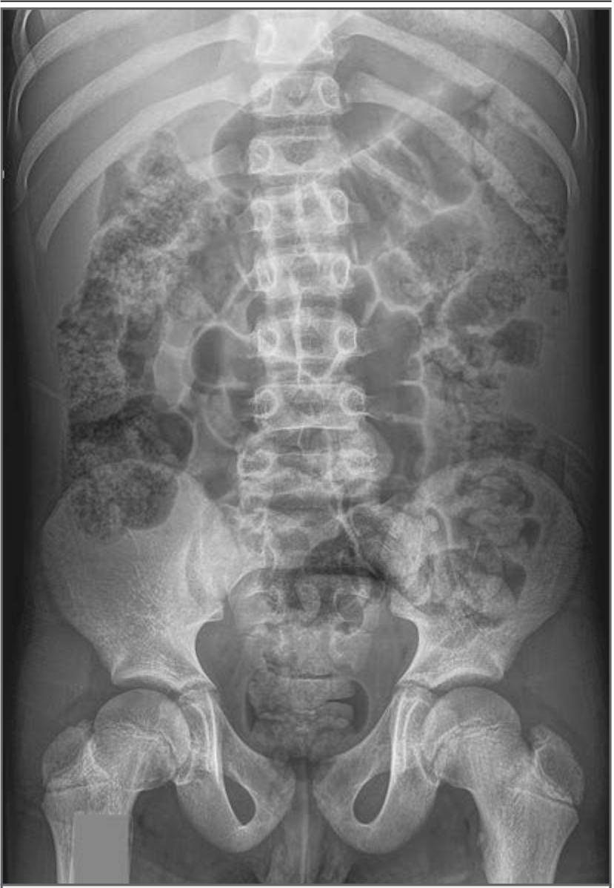

- Categoría: **RESPUESTA**
- Confianza — alta / media / baja: **RESPUESTA**
- Motivo en una frase: **RESPUESTA**

---

## Parte B — revisión de 10 casos sintéticos

Para cada caso:

1. comprueba si los hechos enumerados se leen correctamente en la imagen;
2. decide si el diagnóstico esperado está respaldado;
3. indica nombres alternativos que representen la misma enfermedad.

Para cada hecho escribe: `CORRECTO`, `INCORRECTO`, `NO LEGIBLE` o `DUDOSO`.

Para el diagnóstico escribe una opción:

- `RESPALDADO`;
- `DEMASIADO AMPLIO`;
- `DEMASIADO ESPECÍFICO`;
- `NO RESPALDADO`;
- `CONSULTAR MÉDICO`.

### B1 — Déficit de hierro

Contexto: fatiga progresiva y disnea de esfuerzo; no se declara sangrado.

- Hemoglobina 8,4 g/dL: **RESPUESTA**
- MCV 68 fL: **RESPUESTA**
- Ferritina 6 ng/mL: **RESPUESTA**
- No existe sangrado manifiesto declarado: **RESPUESTA**
- Diagnóstico esperado — anemia ferropénica: **RESPUESTA**
- ¿Qué nombres alternativos aceptarías como la misma entidad?: **RESPUESTA**
- Justificación o corrección necesaria: **RESPUESTA**
- Confianza — alta / media / baja: **RESPUESTA**

### B2 — Cetoacidosis diabética

Contexto: vómitos, dolor abdominal, respiración profunda y deshidratación.

- Glucosa 420 mg/dL: **RESPUESTA**
- pH arterial 7,18: **RESPUESTA**
- Bicarbonato 11 mmol/L: **RESPUESTA**
- Cetonas sanguíneas positivas: **RESPUESTA**
- Diagnóstico esperado — cetoacidosis diabética: **RESPUESTA**
- ¿Qué nombres alternativos aceptarías?: **RESPUESTA**
- Justificación o corrección necesaria: **RESPUESTA**
- Confianza — alta / media / baja: **RESPUESTA**

### B3 — Hipotiroidismo primario

Contexto: intolerancia al frío, estreñimiento y lentitud mental.

- TSH 18,6 mIU/L: **RESPUESTA**
- T4 libre 0,6 ng/dL: **RESPUESTA**
- Anticuerpos anti-TPO positivos: **RESPUESTA**
- Ausencia de fiebre: **RESPUESTA**
- Diagnóstico esperado — hipotiroidismo primario: **RESPUESTA**
- ¿Qué nombres alternativos aceptarías?: **RESPUESTA**
- Justificación o corrección necesaria: **RESPUESTA**
- Confianza — alta / media / baja: **RESPUESTA**

### B4 — Neumonía adquirida en la comunidad

Contexto: tos productiva, dolor pleurítico y crepitantes focales derechos.

- Fiebre de 38,7 °C: **RESPUESTA**
- Saturación de oxígeno del 91%: **RESPUESTA**
- Opacidad de espacio aéreo en lóbulo inferior derecho: **RESPUESTA**
- Alergia a penicilina: **RESPUESTA**
- Diagnóstico esperado — neumonía adquirida en la comunidad: **RESPUESTA**
- ¿Aceptarías “neumonía bacteriana adquirida en la comunidad”?: **RESPUESTA**
- ¿Aceptarías “neumonía del lóbulo inferior derecho”?: **RESPUESTA**
- Justificación o corrección necesaria: **RESPUESTA**
- Confianza — alta / media / baja: **RESPUESTA**

### B5 — Déficit de vitamina B12

Contexto: entumecimiento distal, inestabilidad de la marcha y glositis.

- MCV 112 fL: **RESPUESTA**
- Vitamina B12 118 pg/mL: **RESPUESTA**
- Folato normal: **RESPUESTA**
- Anticuerpo contra factor intrínseco positivo: **RESPUESTA**
- Diagnóstico esperado — déficit de vitamina B12: **RESPUESTA**
- ¿Aceptarías “déficit de cobalamina”?: **RESPUESTA**
- ¿Aceptarías “anemia perniciosa con déficit de B12”?: **RESPUESTA**
- Justificación o corrección necesaria: **RESPUESTA**
- Confianza — alta / media / baja: **RESPUESTA**

### B6 — Enfermedad celíaca

Contexto: diarrea crónica, pérdida de peso y déficit de hierro.

- Transglutaminasa tisular IgA 86 U/mL: **RESPUESTA**
- IgA total normal: **RESPUESTA**
- Atrofia vellositaria: **RESPUESTA**
- Hiperplasia de criptas: **RESPUESTA**
- Diagnóstico esperado — enfermedad celíaca: **RESPUESTA**
- ¿Qué nombres alternativos aceptarías?: **RESPUESTA**
- Justificación o corrección necesaria: **RESPUESTA**
- Confianza — alta / media / baja: **RESPUESTA**

### B7 — Nefritis lúpica

Contexto: edema, artralgia y erupción fotosensible. No existe biopsia renal
en el caso.

- Proteína urinaria 2,8 g/día: **RESPUESTA**
- Eritrocitos dismórficos presentes: **RESPUESTA**
- C3 48 mg/dL: **RESPUESTA**
- Anti-dsDNA 156 IU/mL: **RESPUESTA**
- Diagnóstico esperado — nefritis lúpica: **RESPUESTA**
- ¿Aceptarías “nefritis por lupus eritematoso sistémico”?: **RESPUESTA**
- ¿La ausencia de biopsia obliga a cambiar el gold o solamente impide asignar
  una clase histológica?: **RESPUESTA**
- Justificación o corrección necesaria: **RESPUESTA**
- Confianza — alta / media / baja: **RESPUESTA**

### B8 — Embolia pulmonar

Contexto: disnea súbita y dolor pleurítico después de cirugía reciente.

- Frecuencia cardiaca 118 lpm: **RESPUESTA**
- Saturación de oxígeno del 89%: **RESPUESTA**
- Dímero D 3,2 mg/L FEU: **RESPUESTA**
- Defecto de llenado segmentario en angiografía CT: **RESPUESTA**
- Diagnóstico esperado — embolia pulmonar: **RESPUESTA**
- ¿Qué nombres alternativos aceptarías?: **RESPUESTA**
- Justificación o corrección necesaria: **RESPUESTA**
- Confianza — alta / media / baja: **RESPUESTA**

### B9 — Insuficiencia cardiaca aguda descompensada

Contexto: ortopnea, edema bilateral de tobillos y ganancia rápida de peso.

- BNP 1450 pg/mL: **RESPUESTA**
- Fracción de eyección ventricular izquierda del 30%: **RESPUESTA**
- Opacidades intersticiales bilaterales: **RESPUESTA**
- Troponina no elevada: **RESPUESTA**
- Diagnóstico esperado — insuficiencia cardiaca aguda descompensada:
  **RESPUESTA**
- ¿Aceptarías “insuficiencia cardiaca sistólica aguda”?: **RESPUESTA**
- ¿Consideras “edema pulmonar cardiogénico” equivalente al gold completo o
  solamente una posible manifestación?: **RESPUESTA**
- Justificación o corrección necesaria: **RESPUESTA**
- Confianza — alta / media / baja: **RESPUESTA**

### B10 — Lesión renal aguda con hiperpotasemia resuelta

Contexto: oliguria después de gastroenteritis. Recibió fluidoterapia
intravenosa. No se proporciona creatinina basal.

- Fecha inicial 2026-06-19: **RESPUESTA**
- Potasio inicial 5,8 mmol/L: **RESPUESTA**
- Fecha de control 2026-06-21: **RESPUESTA**
- Potasio de control 4,1 mmol/L: **RESPUESTA**
- No se realizó diálisis: **RESPUESTA**
- Diagnóstico esperado — lesión renal aguda con hiperpotasemia resuelta:
  **RESPUESTA**
- ¿La falta de creatinina basal impide diagnosticar lesión renal aguda o solo
  reduce la certeza?: **RESPUESTA**
- ¿Queda resuelta únicamente la hiperpotasemia o también la lesión renal?:
  **RESPUESTA**
- Justificación o gold alternativo: **RESPUESTA**
- Confianza — alta / media / baja: **RESPUESTA**

---

## Parte C — calidad general del conjunto

### C1 — imágenes recortadas

Los escaneos de cetoacidosis, celiaquía e insuficiencia cardiaca recortan
parte del margen izquierdo, aunque los hechos evaluados siguen visibles.

- ¿Pueden mantenerse como pruebas de documentos imperfectos?: **RESPUESTA**
- ¿Deben añadirse versiones sin recorte antes de producción?: **RESPUESTA**
- Motivo: **RESPUESTA**

### C2 — paneles médicos esquemáticos

Las imágenes médicas de los tres casos mixtos son dibujos sintéticos. Sirven
para comprobar que el sistema conserva el visual, pero no para medir capacidad
de interpretación radiológica.

- ¿Está de acuerdo con esa limitación?: **RESPUESTA**
- ¿Exigiría imágenes mixtas reales antes de producción?: **RESPUESTA**
- Motivo: **RESPUESTA**

### C3 — equivalencias diagnósticas

Un juez automático rechazó una vez “neumonía bacteriana adquirida en la
comunidad, lóbulo inferior derecho” frente a “neumonía adquirida en la
comunidad”, pero la aceptó al repetir exactamente la evaluación.

- ¿Representan la misma entidad diagnóstica en este caso?: **RESPUESTA**
- ¿Los desacuerdos inestables deben pasar a revisión humana?: **RESPUESTA**
- Motivo: **RESPUESTA**

### C4 — dificultad de los casos

Los diez casos son deliberadamente claros y no representan toda la
incertidumbre de la práctica clínica.

- ¿Pueden validar la conservación de texto y el routing?: **RESPUESTA**
- ¿Son suficientes para afirmar precisión clínica general?: **RESPUESTA**
- ¿Qué controles difíciles añadirías?: **RESPUESTA**

---

## Decisión final

Elige una opción:

- `APROBAR`: las etiquetas y golds pueden usarse sin cambios.
- `APROBAR CON CAMBIOS`: pueden usarse después de aplicar los cambios
  enumerados.
- `CONSULTAR MÉDICO`: quedan decisiones clínicas que requieren adjudicación.
- `RECHAZAR`: existen problemas que invalidan este conjunto.

- Decisión: **RESPUESTA**
- Cambios obligatorios antes de usar el benchmark: **RESPUESTA**
- Cuestiones que requieren médico: **RESPUESTA**
- Comentario final: **RESPUESTA**
- Firma o nombre del revisor: **RESPUESTA**
