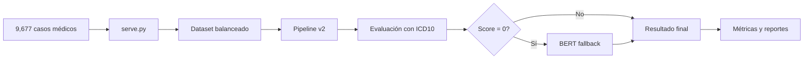

# Pipeline v2 - ICD10 + BERT

## Descripción General

Pipeline de evaluación médica que combina diagnósticos diferenciales generados por LLMs con codificación médica estandarizada (ICD10, SNOMED) y evaluación semántica mediante BERT como fallback. Diseñado para evaluar la precisión diagnóstica y alineación de severidad entre diagnósticos generados (DDX) y diagnósticos de referencia (GDX).

## 📊 Origen de los Datos: El Ecosistema de Datasets

### Pool de Datos Total: 9,677 casos médicos

El pipeline se alimenta de un conjunto diverso de fuentes médicas, totalizando **9,677 casos** organizados en 7 datasets:

| Origen | Archivo | Casos | Descripción | Multi-Dx | Complejidad | Severidad |
|--------|---------|-------|-------------|----------|-------------|-----------|
| **R** | `ramedis.json` | 852 | Casos de enfermedades raras (Rare Disease Medical Information System) | 34.7% | C9-C10 | S9-S10 |
| **Q** | `medqausmle4op.json` | 7,075 | Preguntas médicas del USMLE (United States Medical Licensing Examination) | 0% | C0-C9 | S0-S9 |
| **T** | `urgtorre.json` | 1,398 | Casos de urgencias hospitalarias | 37.5% | C1-C8 | S1-S9 |
| **S** | `rare_synthetic.json` | 200 | Casos sintéticos de enfermedades raras generados por IA | 0% | C2-C8 | S3-S9 |
| **B** | `medbulltes5op.json` | 141 | Casos médicos generales | 0% | C0-C9 | S0-S9 |
| **J** | `new_england_med_journal.json` | 2 | Casos del New England Journal of Medicine | 50% | C5 | S5-S6 |
| **U** | `ukranian.json` | 9 | Casos médicos de Ucrania | 77.8% | C2-C8 | S2-S8 |

### Estructura de los Datos

#### Estructura de un Caso Médico

**En datasets originales (post-normalization):**
```json
{
  "id": "R001",                    // Identificador único (letra origen + número)
  "case": "Descripción clínica detallada del paciente...",
  "complexity": "C7",              // Complejidad del caso (C0-C10)
  "diagnoses": [                   // Lista de diagnósticos correctos (GDX)
    {
      "name": "Ataxia-telangiectasia",
      "severity": "S8"             // Severidad (S0=mínima, S10=crítica)
    }
  ]
}
```

**En datasets servidos (/served/):**
```json
{
  "id": "R001",
  "case": "Descripción clínica...",
  "complexity": "C7",
  "diagnoses": [
    {
      "name": "Ataxia-telangiectasia",
      "normalized_text": "Ataxia telangiectasia",  // Texto normalizado
      "severity": "S8",
      "medical_codes": {}          // Vacío inicialmente, se llena durante evaluación
    }
  ]
}
```

**Nota importante**: Los códigos médicos (ICD10, SNOMED, ORPHA, OMIM) NO están presentes en los datasets base. Se extraen dinámicamente durante la evaluación del pipeline usando Azure Text Analytics Health API.

#### Estadísticas por Dataset

- **Diagnósticos únicos totales**: ~6,500 condiciones médicas diferentes
- **Casos multi-diagnóstico**: 828 casos (8.6% del total)
  - Más comunes en urgencias (T: 37.5%) y casos ucranianos (U: 77.8%)
  - Ausentes en USMLE (Q) y datasets sintéticos (S, B)
- **Cobertura de códigos médicos**: Los datasets post-normalización NO incluyen códigos médicos. Estos se extraen dinámicamente durante la evaluación usando Azure Text Analytics
- **Distribución de complejidad**: Desde casos simples (C0) hasta altamente complejos (C10)
- **Distribución de severidad**: Desde condiciones menores (S0) hasta críticas (S10)

### 🎯 Creación de Datasets de Evaluación con `serve.py`

Para crear datasets balanceados y diversos para evaluación, se utiliza el script `serve.py` ubicado en `data29/data-repos/post-normalization (server)/`. Este script implementa un algoritmo inteligente de selección que:

#### Algoritmo de Selección Inteligente

1. **Sistema de Puntuación**:
   - 5 puntos × capítulos ICD10 nuevos introducidos
   - 3 puntos × bonus por fuente subrepresentada
   - 2 puntos × (complejidad/10)
   - 1 punto × casos multi-diagnóstico
   - 0.5 puntos × (severidad/10)

2. **Fases del Algoritmo**:
   - **Fase 0**: Carga y preparación de datos
   - **Fase 1**: Selección prioritaria respetando reglas min/max por fuente
   - **Fase 2**: Llenado iterativo inteligente maximizando diversidad
   - **Fase 3**: Generación de reportes y visualizaciones

#### Estructura de Salida en `/served/`

```
served/
└── YYYYMMDD_HHMMSS_cN/           # N = número de casos seleccionados
    ├── aggregated_*.json          # Dataset final seleccionado
    ├── report_*.json              # Estadísticas detalladas en JSON
    ├── report_*.txt               # Reporte legible para humanos
    └── plots/                     # 9 visualizaciones sofisticadas
        ├── 1_source_composition.png
        ├── 2_icd10_chapters.png
        ├── 3_complexity_distribution.png
        ├── 4_severity_distribution.png
        ├── 5_diagnoses_per_case.png
        ├── 6_top_diagnoses.png
        ├── 7_source_to_icd10_flow.png
        ├── 8_complexity_severity_heatmap.png
        └── 9_diagnosis_wordcloud.png
```

#### Ejemplo de Uso

```bash
# Crear dataset de 450 casos con configuración personalizada
python serve.py --size 450 --config custom_rules.json
```

Los datasets generados garantizan:
- ✅ Cobertura de los 22 capítulos ICD10 (A-Z)
- ✅ Balance entre fuentes de datos
- ✅ Diversidad diagnóstica (cientos de diagnósticos únicos)
- ✅ Distribución equilibrada de complejidad (C2-C10)
- ✅ ~30% de casos multi-diagnóstico

#### 📦 Flujo: served → bench/datasets

La carpeta `/served/` actúa como área de staging donde `serve.py` genera datasets amalgamados listos para evaluación. El flujo típico es:

```
1. data29/data-repos/post-normalization (server)/
   └── serve.py → genera → served/YYYYMMDD_HHMMSS_c450/aggregated_*.json
   
2. Usuario copia manualmente el dataset generado:
   served/aggregated_*.json → bench/datasets/all_450.json
   
3. Pipeline v2 consume el dataset:
   config.yaml: dataset_path: "bench/datasets/all_450.json"
```

**Importante**: Los datasets en `/served/` son temporales y específicos para cada experimento. Una vez validados, se copian a `bench/datasets/` con nombres descriptivos (ej: `all_450.json`, `rare_only_100.json`, `emergency_focus_250.json`) para su reutilización en múltiples experimentos.

## Estructura del Directorio del Pipeline

```
pipeline_v2 - icd10 + bert/
├── config.yaml                          # Configuración principal del pipeline
├── run.py                              # Script principal de ejecución
├── README.md                           # Esta documentación
├── model_comparison_*.txt              # Reportes comparativos entre modelos
│   ├── model_comparison_20250703_021428_without_bert.txt  # Sin BERT fallback
│   └── model_comparison_20250704_140708_with_bert.txt     # Con BERT fallback
├── eval-prompts/                       # Prompts para evaluación
│   ├── severity_assignment_batch_prompt.txt    # Prompt para asignar severidades
│   └── severity_assignment_batch_schema.json   # Schema de salida para severidades
└── results/                           # Resultados organizados por modelo
    ├── gpt_4_1/                       # Resultados de GPT-4.1
    ├── gpt_4o_summary/                # Resultados de GPT-4o con resumen
    ├── o1/                            # Resultados del modelo O1
    ├── o3_images/                     # Resultados de O3 con imágenes
    └── o3_pro/                        # Resultados de O3 Pro
```

### Estructura de Cada Run

Cada carpeta de modelo contiene múltiples ejecuciones con timestamp (`run_YYYYMMDD_HHMMSS/`):

```
run_20250704_102545/
├── config.yaml                # Snapshot de configuración de la ejecución
├── diagnoses.json            # DDX/GDX con códigos médicos por caso
├── ddx_analysis.csv          # Análisis de frecuencia de DDX generados
├── evaluation.log            # Logs detallados de ejecución
├── run_summary.json          # Métricas globales y análisis consolidado
├── semantic_evaluation.json  # Detalles de evaluación semántica
└── severity_evaluation.json  # Análisis de severidad con métricas de sesgo
```

## Flujo del Pipeline

### FASE 1: Procesamiento de Casos (Paralelo)

Para cada caso médico:

1. **Generación de DDX**: El LLM genera diagnósticos diferenciales basados en la descripción del caso
2. **Extracción de Códigos**: Azure Text Analytics normaliza el texto y extrae códigos médicos (ICD10, SNOMED, ORPHA, OMIM)
3. **Evaluación Semántica**: 
   - Compara DDX vs GDX usando jerarquía ICD10
   - Si el score ICD10 = 0.0, aplica BERT fallback:
     - Cruza todas las combinaciones de texto DDX-GDX
     - Acepta match si similaridad BERT ≥ 0.80
4. **Evaluación de Severidad**: Calcula distancias normalizadas entre severidades DDX-GDX

### FASE 2: Asignación de Severidades

- Extrae diagnósticos únicos de todos los casos
- LLM asigna severidades (S0-S10) en lotes de 50
- Sistema de caché para reutilizar en evaluaciones futuras

**Escala de Severidad:**
- S0: Mínima/sin impacto
- S10: Crítica/potencialmente mortal

### FASE 3: Generación de Archivos de Salida

## Archivos de Salida Detallados

### `run_summary.json`
Contiene métricas globales del experimento:
- Configuración utilizada
- Métricas de precisión (Top-1, Top-3, Top-5)
- Análisis por capítulo ICD10
- Estadísticas de uso de BERT fallback
- Distribución de tipos de código (ICD10, SNOMED, BERT, none)
- Perfilado del dataset por origen (R, U, J, T, Q, B, S)

### `diagnoses.json`
Estructura JSON con todos los casos procesados:
- DDX generados con sus códigos médicos
- GDX de referencia con sus códigos
- Códigos formateados en línea única para facilitar lectura

### `semantic_evaluation.json`
Evaluación detallada caso por caso:
- Scores semánticos para cada combinación DDX-GDX
- Tipo de código usado para matching (icd10/snomed/BERT/none)
- Mejor score alcanzado y diagnósticos asociados

### `severity_evaluation.json`
Análisis de severidad incluyendo:
- Severidades asignadas a cada diagnóstico
- Distancias normalizadas DDX-GDX
- Métricas de sesgo:
  - Sesgo optimista (subestima severidad)
  - Sesgo pesimista (sobreestima severidad)

### `ddx_analysis.csv`
Tabla de frecuencia de diagnósticos generados:
- Diagnósticos más comunes
- Frecuencia de aparición
- Útil para detectar sesgos del modelo

## Comparación de Modelos

Los archivos `model_comparison_*.txt` permiten comparar el rendimiento de múltiples modelos en un subconjunto de casos:

- **Sin BERT**: Evaluación estricta usando solo códigos médicos
- **Con BERT**: Incluye fallback para casos sin matches exactos

Formato de comparación:
```
CASO X/60: [ID]
----------------------------------------
### Modelo: [nombre]
Final Best Score: [score]
Associated DDX: [diagnóstico]
Associated GDX: [diagnóstico de referencia]
Code Type: [icd10/snomed/BERT/none]
```

## Configuración (`config.yaml`)

### Parámetros Principales:

```yaml
experiment_name: "Nombre del experimento"
dataset_path: "bench/datasets/all_450.json"  # Dataset creado con serve.py

dxgpt_emulator:
  model: "gpt-4o-summary"  # Opciones: o1, gpt-4o, medgemma, jonsnow, sakura, openbio, o3-pro, o3
  prompt_path: "ruta al prompt"
  params:
    temperature: 0.1
    max_tokens: 4000
    reasoning_effort: "high"  # Solo para o3/o3-pro: low, medium, high
  output_schema: true  # Fuerza formato de salida estructurado

severity_assigner:
  model: "gpt-4o-summary"
  prompt_path: "eval-prompts/severity_assignment_batch_prompt.txt"
```

## Métricas Clave

### Score Semántico
- Máximo score entre todas las comparaciones ICD10
- Si falla ICD10 (score = 0), aplica BERT con threshold ≥ 0.80
- Registra `code_type` para trazabilidad

### Score de Severidad
- Promedio de distancias normalizadas: `|sev_ddx - sev_gdx| / max_distancia`
- Menor score = mejor alineación de severidad

### Top-K Accuracy
- Porcentaje de casos con score ≥ 0.8 en las primeras K posiciones
- Métricas para Top-1, Top-3, Top-5

### Cobertura de Códigos
- Distribución de sistemas de codificación utilizados
- Porcentaje de uso de BERT fallback
- Casos sin matches (code_type: none)

## Flujo de Trabajo Completo



## Ejecución

```bash
# Paso 1: Crear dataset de evaluación (opcional si ya existe)
cd data29/data-repos/post-normalization\ \(server\)/
python serve.py --size 450

# Paso 2: Ejecutar pipeline de evaluación
cd bench/pipelines/pipeline_v2\ -\ icd10\ +\ bert/
python run.py
```

El pipeline:
1. Carga la configuración desde `config.yaml`
2. Crea directorio de resultados con timestamp
3. Procesa casos en paralelo
4. Genera todos los archivos de salida
5. Imprime resumen de métricas en consola

## Modelos Soportados

- **gpt-4o / gpt-4o-summary**: GPT-4 optimizado
- **gpt-4.1**: Versión actualizada de GPT-4
- **o1**: Modelo O1 de OpenAI
- **o3 / o3-pro**: Modelos O3 con soporte para `reasoning_effort`
- **o3_images**: O3 con capacidad de procesamiento de imágenes
- **medgemma**: Modelo médico especializado
- **jonsnow, sakura, openbio**: Modelos alternativos para comparación

## Análisis de Resultados

El pipeline facilita análisis comparativos mediante:
- Métricas consistentes entre modelos
- Trazabilidad completa de decisiones (qué código/método se usó)
- Detección de sesgos de severidad
- Identificación de fortalezas/debilidades por tipo de caso

Los archivos de comparación de modelos (`model_comparison_*.txt`) proporcionan una vista detallada caso por caso para análisis profundo del comportamiento de cada modelo.

## 🔗 Referencias y Recursos

- [Documentación completa de datasets](../../../data29/README.md)
- [Script serve.py](../../../data29/data-repos/post-normalization%20(server)/README.md)
- [ICD-10 Browser](https://icd.who.int/browse10/2019/en)
- [BERT para similitud semántica](https://huggingface.co/sentence-transformers)